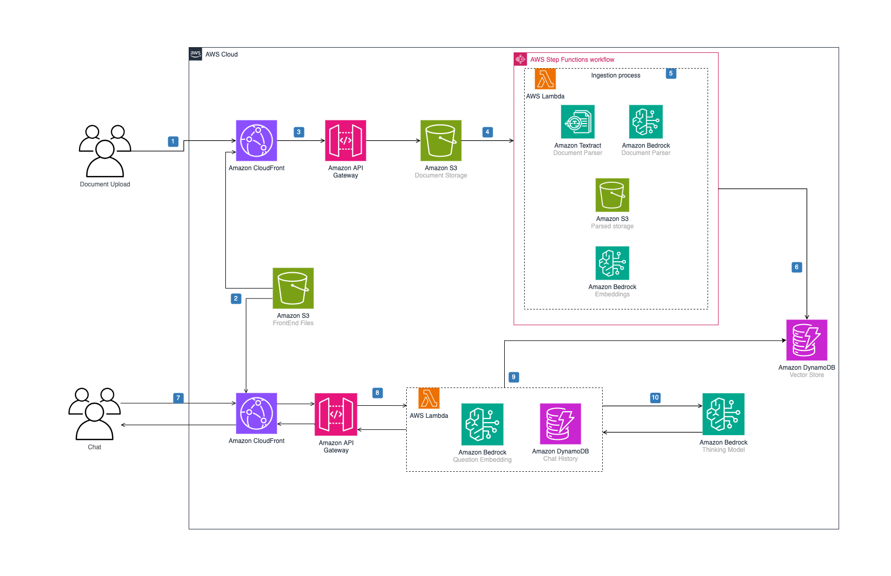
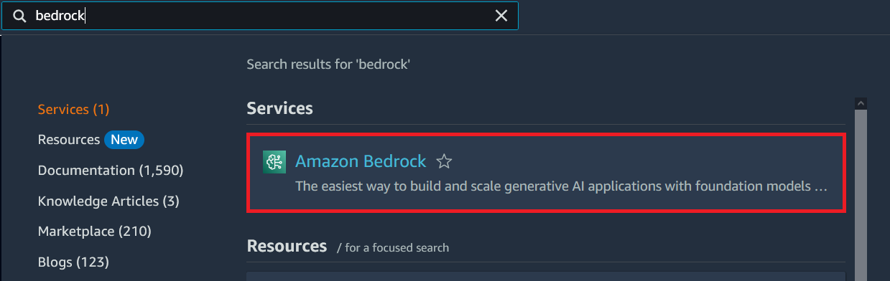
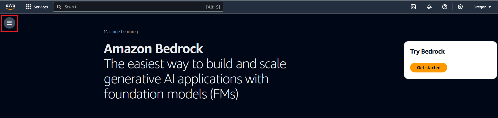
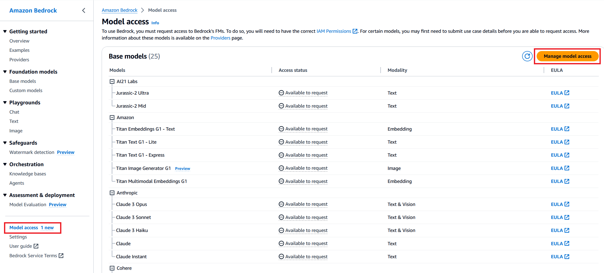

# Guidance for Low Cost Semantic search on AWS


## Table of Contents

1. [Overview](#overview)
    - [Cost](#cost)
2. [Prerequisites](#prerequisites)
    - [Operating System](#operating-system)
3. [Deployment Steps](#deployment-steps)
4. [Deployment Validation](#deployment-validation)
5. [Running the Guidance](#running-the-guidance)
6. [Next Steps](#next-steps)
7. [Cleanup](#cleanup)
8. [FAQ, known issues, additional considerations, and limitations](#faq-known-issues-additional-considerations-and-limitations)
9. [Notices](#notices)
9. [Authors](#authors)

## Overview

Creating RAG architectures tends to be cost prohibitive to small and medium business given the relative High cost of vector DBs, this solution aims to provide a cost effective vector store taking into account the smaller sizes of data used for RAG in Small and Medium Business

### Architecture Diagram



### Cost

_You are responsible for the cost of the AWS services used while running this Guidance. As of Feb 2025, the cost for running this Guidance with the default settings in the US East (N. Virginia) is approximately $29.16 per month for processing and querying (200 records PDF docs, 200KB average file size (10 pags), 6 queries per hour)._

_We recommend creating a [Budget](https://docs.aws.amazon.com/cost-management/latest/userguide/budgets-managing-costs.html) through [AWS Cost Explorer](https://aws.amazon.com/aws-cost-management/aws-cost-explorer/) to help manage costs. Prices are subject to change. For full details, refer to the pricing webpage for each AWS service used in this Guidance._

### Sample Cost Table

These scenarios cover a range of industries and project types, providing examples of how to estimate costs for software development, construction projects, manufacturing processes, and more. Each scenario includes detailed information about the project requirements, constraints, and assumptions, allowing you to follow the step-by-step process of estimating costs.

- **Scenario1:** 100 PDF docs, 200KB averagefile size (10 pags), 6 queries per hour
- **Scenario2:** 200 PDF docs, 200KB average file size (10 pags), 6 queries per hour
- **Scenario3:** 300 PDF docs, 200KB average file size (10 pags), 6 queries per hour
- **Scenario4:** 400 PDF docs, 200KB average file size (10 pags), 10 queries per hour

The following table provides a sample cost breakdown for deploying this Guidance with the default parameters in the US East (N. Virginia) Region for one month.

| Service           | Scenario1 | Scenario2 | Scenario3 | Scenario4 |
| ----------------- | --------- | --------- | --------- | --------- |
| Storage           | $0.03     | $0.03     | $0.01     | $0.25     |
| Compute           | $0.00     | $0.00     | $0.00     | $0.63     |
| DynamoDB r/w      | $4.96     | $9.89     | $14.81    | $32.88    |
| Textract          | $1.50     | $3.00     | $4.50     | $6.00     |
| Bedrock Embedding | $2.00     | $4.00     | $6.00     | $8.00     |
| Bedrock Claude    | $7.14     | $7.14     | $7.14     | $11.90    |
| AWS WAF           | $8.1      | $8.1      | $8.1      | $8.1      |
| Total             | $23.73    | $29.16    | $40.56    | $67.76    |

## Prerequisites

### Operating System

This project uses CDK for deployment you should have either [Docker](https://docs.docker.com/desktop/)/[Podman](https://podman.io/)/[Finch](https://github.com/runfinch/finch). Follow your OS installation guide.

If you are using a container engine different than docker be add `export CDK_DOCKER=$(which finch)` or `export CDK_DOCKER=$(which podman)` to your bash profile

If you don't have CDK installed follow AWS official documentation for [Prerequisites](https://docs.aws.amazon.com/cdk/v2/guide/prerequisites.html), and [Getting Started](https://docs.aws.amazon.com/cdk/v2/guide/getting_started.html)

Ensure that you have credentials in your deployment server/computer one way is that your `~/.aws/config` has credentials with enought permisions to deploy the solution.

```
[default]
region = us-east-1
output = json
```

And your `~/.aws/credentials`

```
[default]
aws_access_key_id = XXXXXXXXXXXXXXX
aws_secret_access_key = XXXXXX/XXXXXXXXXXXXXXXXX
```

### AWS account requirements

Solutions requires access to Amazon Bedrock, the Titan Text embeding model and Anthropic Claude model within it. 

Below we will configure model access in Amazon Bedrock. Amazon Bedrock provides a variety of foundation models from several providers.

Follow the following instruction to setup Amazon Bedrock

1. Find Amazon Bedrock by searching in the AWS console.


2. Expand the side menu.


3. From the side menu, select Model access. Select the Manage model access button.


4. Use the checkboxes to select the models you wish to enable. If running from your own account, there is no cost to activate the models - you only pay for what you use during the labs. Review the applicable EULAs as needed. Select the following Anthropic models:

- Claude 3 Haiku Model
- Titan Text Embeddings V2

Click **Request model access** to activate the models in your account

5. Monitor the model access status. It may take a few minutes for the models to have **Access granted** status. You can use the Refresh button to periodically check for updates.

6. Verify that the model access status is **Access granted** for the selected Anthropic Claude model and Titan embeddings.


### AWS cdk bootstrap


This Guidance uses aws-cdk. If you are using aws-cdk for first time, please perform the below bootstrapping”

* Navigate into the CDK directory.
`cd source/cdk`
* Bootstrap your environment.
`cdk bootstrap`

### Service limits

Keep in mind that all bedrock models have some service limmits that will affect if a user gets for the invoke model operation, for a up-to-date refer to [Bedrock Limits](https://docs.aws.amazon.com/general/latest/gr/bedrock.html#limits_bedrock).

* On-demand InvokeModel requests per minute for Anthropic Claude 3 Haiku us-east-1: 1,000
* On-demand InvokeModel tokens per minute for Anthropic Claude 3 Haiku 2,000,000

### Supported Regions

This Guidance is built for us-east-1 region

## Deployment Steps

* _If using virtual environments activate it depending your OS and install pip libraries to be able to use cdk deploy command_ i.e. `pyenv activate environment`

* Navigate into the CDK directory.
`cd source/cdk`

`pip install -r requirements.txt`

* Review the Cloudformation Template.
`cdk synth`
* Deploy the stack
`cdk deploy`

* _If you want to enable self user sing up (not recomended) use the following deploy command instead:_
`cdk deploy --c selfSignup=True`

## Deployment Validation

* Open CloudFormation console and verify the status of the template with the name starting with ChatbotStack.
* If the deployment was successful you will see an output in the cdk called  `ChatbotStack.AdminPortal`
## Running the Guidance
### UserCreation
You will need to create a User in Amazon Cognito. If you opted for SelfSingUp enabled you could navigate to the cloudfront distribution and you will get redirected to the Amazon Cognito HostedUI for user creation.

If you deployed **WITHOUT**  `--c selfSignup=True` you need to create a user directly in the [Amazon Cognito API/Console](https://docs.aws.amazon.com/cognito/latest/developerguide/how-to-create-user-accounts.html) and add them to the default [Group that is precreated](https://docs.aws.amazon.com/cognito/latest/developerguide/cognito-user-pools-user-groups.html).

1. User uploads documents to the portal
2. Through an API, raw docs are stored on Amazon S3 
3. Upload process triggers the ingestion state machine on Step Functions. Documents are processed by Textract and Claude to extract text from documents. Textract and Claude results are stored in raw format and Json on S3
4. A Lambda function creates text chunks in vectors using Titan Embeddings model using Bedrock APIs
5. According to chunk sizes, vectors are stored on separate DynamoDB tables

**Config, Prompting and Inference Workflow**

1. User selects to either query the Textract or LLM vector store and updates prompt on the portal
2. Through an API, the user query is sent to a Lambda Function
3. User prompt is converted to vectors using Titan Embeddings model using Bedrock APIs
4. Lambda retrieves vectors from DynamoDB tables with semantic similiraties
5. User prompt + Context (vectors with semantic similiraties) are sent to Claude3 Haiku model using Bedrock APIs
6. Response from Bedrock model is returned to user
7. Conversation History is stored on a DynamoDB table for context


## Next Steps

Multiple configuration may be applied to the process using Lambda Environment variables:

AIBotDockerLambda(prediction_lambda)
* `DYNAMO_PAGE_SIZE`
* `TOLERANCE`
* `EMBEDDING_MODEL_ID`
* `MODEL_ID`

StoreChunkDynamo(step4)
* `CHUNK_SIZE`

Also You can integrate this Guidance using the pre-provided lex bot deployment to add them into other applications or systems

## Cleanup


* Navigate into the CDK directory.
`cd source/cdk`
* Deploy the stack
`cdk destroy`

## FAQ, known issues, additional considerations, and limitations


**Known issues (optional)**

<If there are common known issues, or errors that can occur during the Guidance deployment, describe the issue and resolution steps here>


## Notices

*Customers are responsible for making their own independent assessment of the information in this Guidance. This Guidance: (a) is for informational purposes only, (b) represents AWS current product offerings and practices, which are subject to change without notice, and (c) does not create any commitments or assurances from AWS and its affiliates, suppliers or licensors. AWS products or services are provided “as is” without warranties, representations, or conditions of any kind, whether express or implied. AWS responsibilities and liabilities to its customers are controlled by AWS agreements, and this Guidance is not part of, nor does it modify, any agreement between AWS and its customers.*


## Authors

Gasamoma
JmGomez
ElRuncho
Hercamil
Lzanda